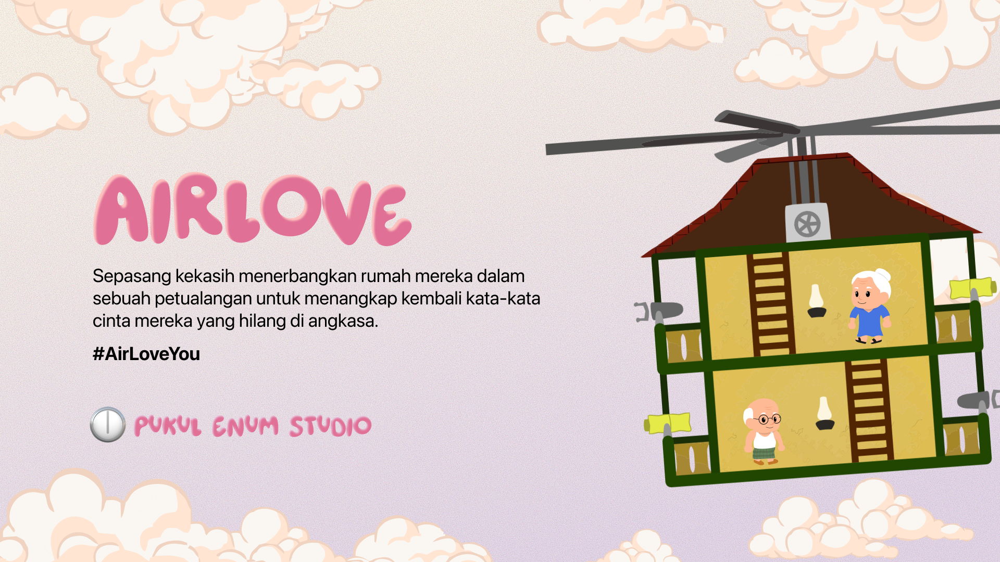

# 💗 AirLove

**AirLove** adalah sebuah game aksi-petualangan penuh cerita yang membawa pemain dalam kisah mengharukan sepasang kekasih yang menerbangkan rumah mereka ke langit demi menangkap kembali kata-kata cinta yang hilang. Sebuah kisah cinta yang manis, dibungkus dalam gameplay ringan dan visual yang hangat.



---

## 📖 Sinopsis

> Sepasang kekasih menerbangkan rumah mereka dalam sebuah petualangan untuk menangkap kembali kata-kata cinta mereka yang hilang di angkasa.  
>  
> **#AirLoveYou**

---

## 🎮 Game Stats

| **Kategori**       | **Detail**                     |
|--------------------|--------------------------------|
| 🎮 Genre           | Action, Adventure, Story-rich  |
| 💵 Price           | Try before you buy             |
| ⏰ Playtime        | 2H 30m                          |
| 🧩 Game Engine     | Unity                          |
| 📱 Target Platform | Mobile                         |
| 🚧 Status          | Pre-Alpha                      |

---

## 🖼️ Screenshot

 

## 🛠️ Cara Menjalankan Proyek

1. **Clone repo ini:**
   ```bash
   git clone https://github.com/kurak57/AirLove.git

2. Buka folder dengan Unity Hub dan pilih Unity versi 6 atau yang lebih tinggi.

3. Buka scene utama dari folder Scenes/.

4. Klik tombol ▶️ Play di editor Unity.
